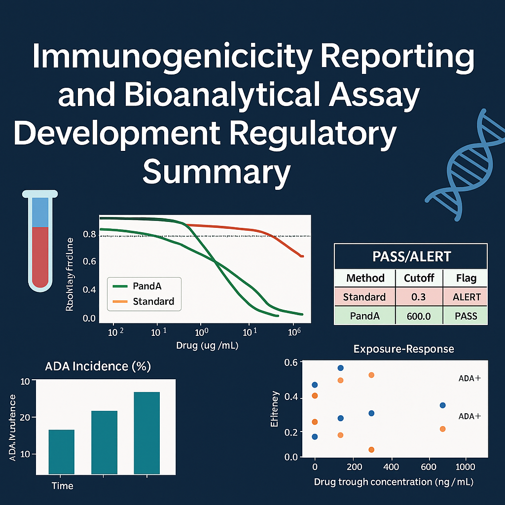

# 🧬 regulatory-clinpharm-ADA-immunogenicity-reporting-and-bioanalytical-summary

### Automated generation of Clinical Pharmacology and Immunogenicity regulatory summaries integrating ADA assay performance, PandA correction, and bioanalytical validation data



---

## 📘 Overview

This repository provides a reproducible, end-to-end framework for generating **submission-ready Clinical Pharmacology (ClinPharm) and Immunogenicity reports**.  
It automates the analysis and documentation of **anti-drug antibody (ADA) assay performance**, **PandA drug tolerance correction**, and **exposure–response outcomes**, aligning with **FDA/EMA regulatory guidance** and **bioanalytical reporting standards**.

The project consumes pre-processed datasets (e.g., `tlgs.parquet`, `benchmarks.parquet`, and figures) from the companion simulation repo [**ada-panda-mini**](https://github.com/camontefusco/ada-panda-mini), and outputs a **clinically interpretable PDF or HTML summary** suitable for inclusion in:

- **Bioanalytical Reports (BARs)**
- **Integrated Summaries of Immunogenicity (ISI)**
- **Module 2.7.2 / 2.7.6 Clinical Pharmacology documents**

---

## 🎯 Purpose

Therapeutic proteins are often immunogenic, producing **anti-drug antibodies (ADA)** that can alter exposure, efficacy, or safety.  
However, **bridging immunoassays** can underestimate ADA prevalence at therapeutic drug concentrations due to **drug interference** — leading to false negatives and biased exposure–response assessments.

The **PandA method** (PEG precipitation + Acid dissociation) restores ADA detectability at high drug levels, providing a more accurate view of immunogenicity risk.

This repository demonstrates how to:

1. Import simulated or experimental ADA + PK data  
2. Generate validated **drug-tolerance and bias assessments**  
3. Compare standard vs. PandA detection  
4. Produce regulatory-style tables, listings, and figures (TLGs)  
5. Render a final ClinPharm report with interpretable conclusions

---

## 🧠 Repository Structure

```arduino
regulatory-clinpharm-ADA-immunogenicity-reporting-and-bioanalytical-summary/
├── notebooks/
│ ├── 01_import_and_QC.ipynb # Load datasets, integrity checks
│ ├── 02_TLGs_and_figures.ipynb # Generate summary TLGs + plots
│ └── 03_render_report.ipynb # Knit to PDF/HTML using RMarkdown
│
├── templates/
│ └── ClinPharm_Summary_template.Rmd # Submission-style template
│
├── input/
│ ├── tlgs.parquet # Tables, Listings, Graphs (TLGs)
│ ├── benchmarks.parquet # PASS/ALERT criteria
│ └── figures/ # Plots from ada-panda-mini
│
├── output/
│ ├── report_params.yaml
│ ├── ClinPharm_Summary.html
│ └── ClinPharm_Summary.pdf
│
└── config.yaml # Report metadata + parameters
```

---

## ⚙️ How to Run

### 1️⃣ Environment Setup
```bash
mamba create -n clinpharm python=3.11 pandas matplotlib pyyaml jinja2 quarto pandoc -y
mamba activate clinpharm
```
---

## 2️⃣ Input Data

### Copy the outputs from your ada-panda-mini simulation:
 ```bash
cp -r ../ada-panda-mini/reports ./input
```
## 3️⃣ Run Sequentially
```bash
jupyter nbconvert --execute notebooks/01_import_and_QC.ipynb
jupyter nbconvert --execute notebooks/02_TLGs_and_figures.ipynb
jupyter nbconvert --execute notebooks/03_render_report.ipynb
```
💡 The final ClinPharm Summary will be saved to:
output/ClinPharm_Summary.pdf

---

## 📊 Typical Outputs

### **Drug-tolerance curves**
Demonstrates ADA assay performance across drug concentrations:

- **Standard assay:** rapid loss of recovery above ~10 µg/mL  
- **PandA-corrected assay:** maintains ≥80% recovery up to 500–1000 µg/mL  

---

### **ADA incidence and detection bias**
Quantifies the underestimation of ADA-positive rates under standard methods versus PandA-corrected assays.

---

### **Week-52 exposure and trough comparisons**
Shows how ADA positivity impacts trough concentrations and target attainment.

---

### **PASS/ALERT benchmarks**
Summarizes whether the assay meets FDA-style drug tolerance validation thresholds (≥80% recovery).

---

## 🧾 Example Figures

| Figure | Description |
|--------|--------------|
|  | Simulated vs. literature assay recovery |
|  | ADA incidence over time |
|  | Detection probability vs. drug level |
|  | PK exposure by ADA status |
|  | PASS/ALERT validation summary |
|  | True exposure–response relationship |

---

## 🧩 Integration

| **Source Repo** | **Output of This Repo** |
|------------------|--------------------------|
| [`bioanalytical-ADA-drug-interference-to-pandA-correction-method-development`]([https://github.com/camontefusco/ada-panda-mini](https://github.com/camontefusco/bioanalytical-ADA-drug-interference-to-pandA-correction-method-development)) | Simulated PK/ADA datasets, assay recovery |
| `regulatory-clinpharm-ADA-immunogenicity-reporting-and-bioanalytical-summary` | BAR/ISI-ready ClinPharm report (PDF/HTML) |
| *(Optional)* `dmpk-standards-interoperability` | CDISC ADaM-like and FHIR data export (planned) |

---

## 📈 Example Summary

- **Assay Artifact:** Standard ADA assays underestimate immunogenicity at therapeutic levels.  
- **PandA Solution:** PEG + acid dissociation restores ADA detection and recovery.  
- **Bioanalytical Impact:** Improved drug tolerance and reduced bias in quantification.  
- **Clinical Impact:** Corrected ADA detection reveals true PK variability and clearance effects.  
- **Regulatory Alignment:** Meets FDA/EMA guidance for drug tolerance validation, bias control, and immunogenicity risk assessment.

---

## 🧪 References

- **FDA Guidance (2019)** — *Immunogenicity Testing of Therapeutic Protein Products*  
- **Zoghbi et al., AAPS J (2015)** — *PandA method improves drug tolerance in ADA assays*  
- **Sanofi EBF Workshop (2024)** — *Practical defaults for PandA validation*  
- **Celerion Poster (2020)** — *Bridging vs. PandA: ADA recovery up to 800 µg/mL drug*

---

## 🧾 Summary of Utility

This repository provides a **regulatory-facing bridge** between:

- **Bioanalytical assay development**  
- **Clinical pharmacology interpretation**  
- **Regulatory reporting**

By automating both computation and documentation, it ensures:

- ✅ **Reproducibility and traceability**  
- ✅ **Cross-functional alignment** between BioA, ClinPharm, and Regulatory Affairs  
- ✅ **Compliance** with global immunogenicity and assay validation standards

---

## 📬 Contact
Carlos Montefusco
📧 cmontefusco@gmail.com
🔗 GitHub: /camontefusco
